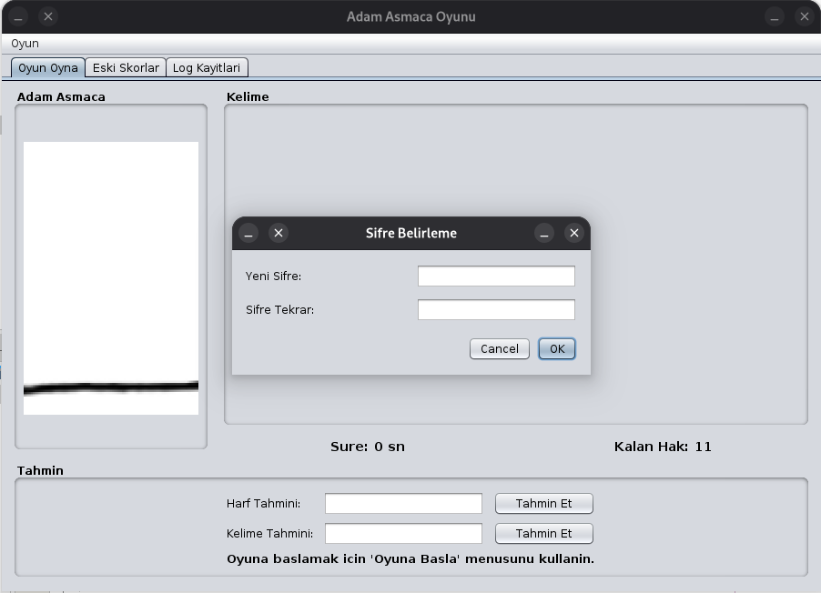

# Adam Asmaca Oyunu

**Öğrenci No:** 2211012611



## Proje Hakkında

Bu proje, Java Swing kullanılarak geliştirilmiş bir **Adam Asmaca (Hangman)** oyunudur. 
Kullanıcıların rastgele seçilen kelimeleri harf ve kelime tahminleri yaparak bulmaya çalıştığı 
interaktif bir masaüstü uygulamasıdır.

## Özellikler

- **Şifre Koruma:** Uygulama ilk açılışta şifre belirleme ekranı sunar. Sonraki açılışlarda 
  şifre ile giriş yapılır. 3 hatalı denemede program kapanır.
- **Oyun Oynama:**
  - Rastgele seçilen kelime için harf sayısı kadar dinamik label oluşturulur
  - Harf tahmini ve kelime tahmini olmak üzere iki farklı giriş alanı
  - Her yanlış tahminde adam asmaca resmi adım adım görüntülenir (11 aşama)
  - 11 yanlış tahminde oyun başarısızlıkla sonlanır
  - Oyun süresi saniye olarak takip edilir
- **Eski Skorlar:** Geçmiş oyunların süre ve sonuç bilgileri JTable ile listelenir
- **Log Kayıtları:** Tüm giriş ve şifre denemeleri kayıt altına alınır
- **Menü Sistemi:** Oyuna Başla, Oyunu Yeniden Başlat, Çıkış işlemleri

## Kullanılan Teknolojiler

- **Java 21** - Programlama dili
- **Swing** - GUI framework
- **Maven** - Proje yönetim aracı
- **NetBeans IDE** - Geliştirme ortamı


## Dosya Yapısı

```
  P2Oyun/
  ├── Resimler/          # Adam asmaca resimleri
  └── TXTDosyalar/
      ├── sifre.txt       # Kullanıcı şifresi
      ├── kelimeler.txt   # 30 adet 6+ harfli kelime
      ├── log.txt         # Giriş kayıtları
      └── oyunlar.txt     # Oyun skorları
```

## Platform Desteği

- **Windows:** `C:\P2Oyun\` dizini kullanılır
- **Linux/macOS:** `~/P2Oyun/` dizini kullanılır


